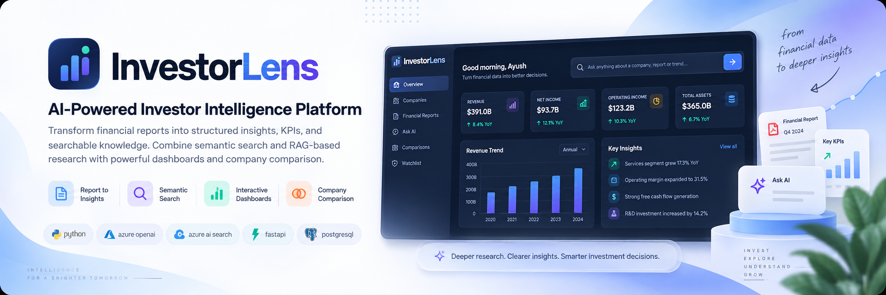

<p align="center">
  
</p>

<p align="center">
  <strong>An AI-powered investor intelligence platform for financial research and analysis.</strong>
</p>

<p align="center">
  <a href="https://www.python.org/"></a>
  <a href="https://azure.microsoft.com/en-us/products/ai-services/openai-service"></a>
  <a href="https://azure.microsoft.com/en-us/products/ai-services/ai-search"></a>
  <a href="https://docs.astral.sh/uv/"></a>
</p>

<p align="center">
  <a href="#overview">overview</a> ·
  <a href="#current-capabilities">current capabilities</a> ·
  <a href="#technology">technology</a> ·
  <a href="#project-structure">project structure</a> ·
  <a href="#documentation">documentation</a> ·
  <a href="#roadmap">roadmap</a>
</p>

---

<h2 align="center">overview</h2>

**InvestorLens** is an AI-powered investor intelligence platform being developed to simplify financial research and analysis.

The project uses annual reports as its primary data source and explores how document processing, semantic search, and AI can turn large financial reports into searchable research knowledge.

---

<h2 align="center">current capabilities</h2>

The completed implementation currently covers the document processing and retrieval foundation.

- annual report processing
- PDF to markdown conversion
- semantic document chunking
- Azure OpenAI integration
- embedding generation
- Azure AI Search integration
- vector search
- metadata filtering

---

<h2 align="center">technology</h2>

| Layer | Technology |
| --------------------- | ---------------------------- |
| **Language** | Python 3.12 |
| **Document processing** | PyMuPDF4LLM |
| **Semantic chunking** | LangChain SemanticChunker |
| **AI & embeddings** | Azure OpenAI |
| **Search & retrieval** | Azure AI Search |
| **Package management** | UV |

---

<h2 align="center">project structure</h2>

```text
investorlens/
├── docs/
│   ├── assets/
│   │   └── investorlens-banner.png
│   ├── Business Requirements.docx
│   ├── InvestorLens_PRD.docx
│   ├── InvestorLens_TRD.docx
│   ├── Logical Arch & Notes.excalidraw
│   ├── Physical-architecture.drawio
│   └── Presentation.pptx
│
├── ingestion/
│   ├── __init__.py
│   ├── ingest_documents.py
│   ├── pdf_to_markdown.py
│   └── semantic_chunker.py
│
├── llm/
│   ├── __init__.py
│   └── azure_openai.py
│
├── vectorstore/
│   ├── __init__.py
│   ├── azure_ai_search.py
│   └── create_index.py
│
├── .dockerignore
├── .gitignore
├── project_journey.md
├── README.md
└── requirements.txt
```

---

<h2 align="center">documentation</h2>

The project is documented throughout its development.

- **BRD** — business requirements and project scope
- **PRD** — product requirements and user flows
- **TRD** — technical requirements and implementation direction
- **Architecture diagrams** — logical and physical architecture
- **Project Journey** — phase-by-phase development progress
- **Presentation** — project overview

The detailed documentation is available in `docs/` and `project_journey.md`.

---

<h2 align="center">roadmap</h2>

The project is being developed across **13 planned phases**.

### completed

**phases 1–6**

- project planning
- dataset preparation
- PDF to markdown conversion
- semantic chunking
- Azure OpenAI integration
- Azure AI Search integration

### upcoming

**phases 7–13**

- KPI extraction
- Azure SQL integration
- FastAPI backend
- React frontend
- RAG research pipeline
- containerization
- AKS deployment

---

<h2 align="center">current status</h2>

**🚧 active development**

The document processing and retrieval foundation is currently complete through **phase 6 — Azure AI Search integration**.

The remaining analytics, application, RAG, and cloud deployment layers are being developed in subsequent phases.

---

See you in the next phase.

**— aps**
